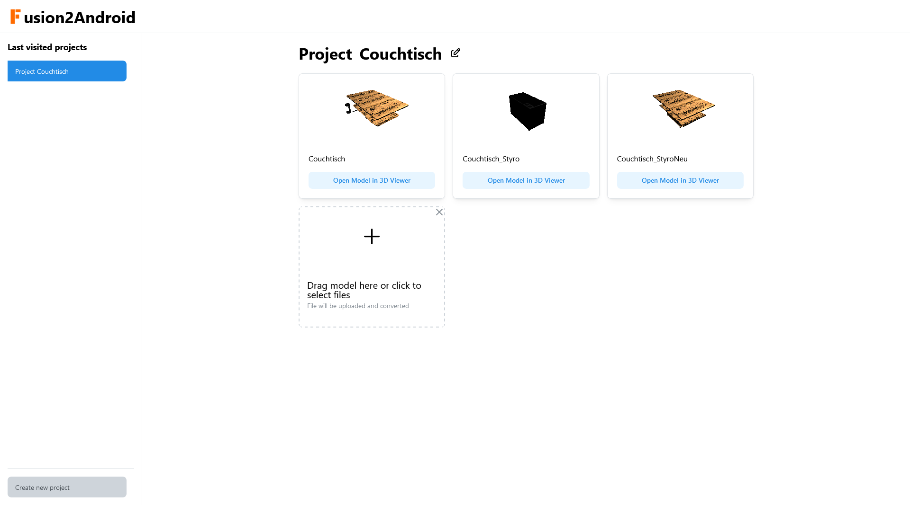

[](https://github.com/fabalexsie/WebAppStarterTemplate)


# Welcome to <span style="color: #ff6b00">F</span>usion2Android!

As you already can guess. This projects aims to help showing a model from Fusion 360 on an android device. It is a web application that can be used to upload a .usd file and directly provides a link which can be used on an android device to view the model in AR.

## Why was it needed?

You've designed some work with the help of Fusion 360 and you're quite happy with the result. But now you want to see it in AR. There are two ways to do this. First you can export the model as an .usd file and copy it to an IOS device, which natively supports the format and let you view it through the camera in AR. But what if you don't have an IOS device?

On android devices you can use the [Scene Viewer from ARCore](https://developers.google.com/ar/develop/scene-viewer#3d-or-ar) to view the model in AR. But the problem is that it only supports the .gltf format. And Fusion 360 doesn't support exporting to .gltf.

This project aims to solve this problem. It provides a python script that can be used to convert a .usd file to a .gltf file. To make it more useful in practice, the script is wrapped inside a small web application, that can be used to upload a .usd file and directly provides a link which can be used on an android device to view the model in AR.

It also has the nice feature that you can directly share the link to your project/collection of models with others, so they can easily view your models in AR, too.

---

## Screenshot

[](res/screenshot_project_view.png)

---

## Features

- .usd model files are automatically converted to .gltf files when uploaded
- A preview of your model is shown in the project/collection
- You can view your model in AR on an android device by clicking on the link
- Web app can be run as a docker container
- You need an admin password to create a new project page
- Each project has a generated password, which must be provided to upload new models

---

## Run it yourself

### Production (docker)

For a production build of the webserver, you can use the docker container, which will install all dependencies and run the web application. Copy the file `compose.example.yml` to `compose.yml` and change the environment variables to your needs.

> Information: The `Dockerfile` can be used on x86_64 (amd64) devices. On aarch64 (arm64) devices, you have to build one python wheel yourself. This is included in the `Dockerfile.arm` which took ~25 minutes to build on my server.
> Select the correct Dockerfile for your device in the `compose.yml` file.

Requirements

- Docker (tested with 20.10.24)
- a `data` folder at root level (See [Files](#files))

```bash
docker compose up --build -d
```

### Developing (node & python)

If you want to run the web application locally and want to see the changes you make to the code immediately, you can use the following commands.

Requirements:

- Python (tested with 3.10)
- node (tested with v18.14.2 and pip v22.3.1)
- create a `.env` file in the root directory of the project and define the environment variables (see [Environment variables](#environment-variables))
- a `data` folder at root level (See [Files](#files))

```bash
## Install npm dependencies frontend
cd frontend
npm install
cd ..
## Install npm dependencies backend
npm install
## Install python dependencies
cd python
python3 -m pip install -r requirements.txt
cd ..
# Run the web application - frontend and backend which uses the python script
npm start
```

> Tipp: You can create a virtual environment for the python dependencies with conda. (More information: [Creating an environment from an environment.yml file](https://docs.conda.io/projects/conda/en/latest/user-guide/tasks/manage-environments.html#creating-an-environment-from-an-environment-yml-file))

> Hint: If you want to use the python script without the web application, you can use the following command: `python3 python/usd2gltf.py <input_file> <output_directory>`

### Environment variables

| Variable name | Description                                                                                                                                                                                |
| ------------- | ------------------------------------------------------------------------------------------------------------------------------------------------------------------------------------------ |
| PORT          | The port on which the web application will be available.                                                                                                                                   |
| ADMIN_PW      | The password that is needed to create a new project.                                                                                                                                       |
| IS_DEV        | Set to true if you have a conda environment with the name usdz and the python dependencies installed there. Otherwise set to false (if you have installed the required packages globally). |

> Additional information: If you only want to build the package usd-core yourself for and arm64 device, you can use the `Dockerfile.UsdCoreArmWheelBuilder`. The resulting wheel can be found in the `/opt/USD-dist` folder. You may want to add a volume to the docker container.

### Files

The data folder is needed for the db and the converted files. The sqlite db manages the project names, ids and passwords. The converted files are stored in a named folder inside the project folder which is named after the project id.

Folder structure the data folder will have:

```
 +--data\
   +--uploads\
   |  \--... all uploaded files are stored here before processed
   |     if an error occured they will be kept
   |     else they will be deleted afterwards
   +--userFiles\
   |  +--<folder with the name of the project id (uuid)>
   |  |  +--<folder with the name of the uploaded model filename>
   |  |  |  +--*.gltf
   |  |  |  +--*.bin
   |  |  |  +--*.png
   |  |  |  \--... all converted model files for this uploaded file
   |  |  \--... other models inside the folder
   |  \--... other projects (e.g. '34aefd0a-94d0-4bdb-...')
   \--db.sqlite
```

--

## Contributing

If you have any questions or suggestions, feel free to open an issue.
If you want to contribute to this project, please open a pull request. I appreciate any suggestions and improvements.

## "License"

Would be nice if you could mention me ([fabalexsie](https://github.com/fabalexsie/)), if you use this project or parts of it. I will be happy to see what you created with it. (When you leave me a message to your project, I may reference it here.)

<details>
<summary>
<h2 style="display: inline-block;">Challenges while developing / Creation process</h2>
</summary>
<h3>Scale factor</h3>

Thanks to the python project [usd2gltf](https://pypi.org/project/usd2gltf/) from [mikelyndon](https://github.com/mikelyndon), the first conversion was quite easy. Then I created the link according to the documentation from google to provide the gltf file as an intent for the Scene Viewer. This worked out pretty good.

Then I wanted to see the model in AR, but it was huge. The problem was, that Fusion 360 exported my model in mm but the scene viewer interpreted each unit as 1m. So I had to scale the model down by a factor of 1000. So I adapted my python script to scale the usd scene down by factor 1000 and then convert it to gltf.

<h3>Scaling of usd file format</h3>

Next problem occured: Some parts of the usd scene encoded in the file format as matrix transformation instead of translation, rotation and scale. This caused the scaling to not work properly for these parts. So I had to adapt the python script to convert the matrix transformation to translation, rotation and scale.

(Of course i also tried converting the exported gltf file, but this lead to a similar problem, that some components were not scaled.)

<h3>Running inside a docker container (on aarch64 instead of x86_64)</h3>

Wrapping the python script inside a web application was done straightforward with the help of my [WebAppStarterTemplate](https://github.com/fabalexsie/WebAppStarterTemplate). Then I tested it inside docker to later upload it to a server. Everything was running perfect.

So I pushed the code to the server and build the docker image. But it failed with the error that the python package `usd-core` (a dependency from usd2gltf) was not found for this platform. Long story short: I compiled and installed the package from source inside the docker container on aarch64 and then it worked. (Thanks to [instantapfel](https://github.com/instantapfel/) for his help with this part.)

</details>
